# Enigmes

```mermaid
flowchart TB
    z2("Quête Principale")
    z3("Quête secondaire")
    z4("Interaction virtuel")
    z5("Interaction Mixte")
    z6("Interaction Réel")
    z1("Syncronisation")
    
    subgraph DDust2
        a1("Ordinateur du dev")
        a2("Carte de l'étage")
        a3("Dévérouillage des portes")
        a4("Enquêtes")
        a5("Dates de naissance de son frère")
        a6("Journaux réussite de l'ia")
        a7("Lampe torche")
        a8("Lignes de code")
        a9("Game bible")
        a10("Inscriptions sur le mur")
    end
    
    subgraph "Premier Couloir"
        b1("Sac renversé")
        b2("Casier couloir")
    end
    
    subgraph Totoro
        c1("Timer entrée en Totoro")
        c2("Sécutité couloir")
        c3("Désactivation des caméras")
        c4("Active la suite sur la carte")
        c5("Chaud froid")
        c6("Diaporama")
        c7("Faiblesses de l'ia")
        c8("Fouilles")
        c9("Salle des serveurs")
        c10("Note du projet par les intervenants")
        c11("Projecteur")
        c12("Tableau ardoise")
    end
    
    subgraph "Deuxième Couloir"
        d1("Ouverture Corvo")
        d2("Enigme ampoules")
        d3("Scène de crime")
        d4("Dossier sur la porte")
    end
    
    subgraph Corvo
        e1("Reboot de l'ia")
        e2("Le parcour apparait")
        e3("Choix final")
    end
    
    z1 -- Ordinateur allumé dans le virtuel --> a1
    z1 -- Fouille sur le bureau près de l\'ordinateur --> a7
    z1 -- Fouille dans la salle virtuelle --> a9
    z1 -- Inscriptions sur le mur virtuelle et réelle --> a10
    a1 -- Photos du dev + mot de passe --> a2
    a2 -- Rétablir le code --> a3
    a1 -- Fouille de l'ordinateur --> a4
    a4 --> a5
    a1 -- Fouille de l'ordinateur --> a6
    a7 -- "Capteurs lumineux\n1 - Sur l’ordinateur du dev\n2 - Mur noir\n3 - Porte\n." --> a8
    a8 --> a2
    a5 -- Enigme de la vie --> b2
    a6 -- Enigme de la vie --> b2
    a3 --> c1
    c1 -- Au bout de 2min --> c2
    c2 -- Enigme de la vie --> b2
    c2 --> c3
    c3 --> c4
    c4 --> c5
    c6 -- Lecture du diapo --> c7
    c6 -- Enigme de la vie --> b2
    c7 -- Capteur lumineux sur les cams --> c3
    a9 -- "Lecture de la game bible (nom de la salle)" --> c9
    c6 -- "Lecture du diapo (emplacement)" --> c9
    a6 --> c10
    c10 -- Enigme de la vie --> b2
    a7 --> c11
    c1 --> c11
    c1 -- Capteurs lumineux sur le projecteur --> c11
    c12 -- Enigme de la vie --> b2
    c5 -- Clé porte de totoro --> d1
    b2 -- Ampoule --> d2
    c8 -- Ampoule --> d2
    b1 --> d3
    d3 -- Ampoule --> d2
    d1 -- Nom du frère disparu --> e1
    d4 -- Nom du frère disparu --> e1
    b1 -- Nom du frère disparu --> e1
    a10 --> e1
    e1 -- Surchauffer la RAM avec des capteurs de chaleur --> e2
    c12 -- jeu d'échec --> e2
    e2 -- Réussite du parcours et pression sur le bouton --> e3
    
    y1("Fuite de la simulation")
    y2("IA scéllée")
    
    e3 --> y1
    e3 --> y2
    
    style z1 fill:#040b34, stroke:#ff0000
    style z2 fill:#040b34
    style z3 fill:#038a55
    style z4 fill:#19191c00, stroke:#ff0000
    style z5 fill:#19191c00, stroke:#ff0000, stroke-dasharray: 10 5
    style z6 fill:#19191c00, stroke:#ff000000
    
    style a1 fill:#040b34
    style a2 fill:#040b34, stroke:#ff0000
    style a3 fill:#040b34
    style a4 fill:#038a55
    style a5 fill:#038a55
    style a6 fill:#038a55
    style a7 fill:#038a55, stroke:#ff0000, stroke-dasharray: 10 5
    style a8 fill:#038a55, stroke:#ff0000
    style a9 fill:#038a55, stroke:#ff0000
    style a10 fill:#038a55, stroke:#ff0000, stroke-dasharray: 10 5

    style b1 fill:#038a55
    style b2 fill:#040b34
    
    style c1 fill:#040b34
    style c2 fill:#040b34, stroke:#ff0000
    style c3 fill:#040b34
    style c4 fill:#040b34, stroke:#ff0000
    style c5 fill:#040b34, stroke:#ff0000
    style c6 fill:#040b34, stroke:#ff0000, stroke-dasharray: 10 5
    style c7 fill:#040b34
    style c8 fill:#040b34, stroke:#ff0000
    style c9 fill:#ff00bf
    style c10 fill:#038a55
    style c11 fill:#038a55, stroke:#ff0000, stroke-dasharray: 10 5
    style c12 fill:#038a55
    
    style d1 fill:#040b34
    style d2 fill:#040b34
    style d3 fill:#038a55, stroke:#ff0000
    style d4 fill:#038a55
    
    style e1 fill:#040b34
    style e2 fill:#040b34
    style e3 fill:#040b34
    
    style y1 fill:#ff3131
    style y2 fill:#7ed957
```

<tabs>
<tab title="Complete view">

</tab>
<tab title="Simplified view">

</tab>
</tabs>

```mermaid
flowchart TB
    subgraph Corvo
        e1("Reboot de l'ia")
        e2("Le parcour apparait")
        e3("Choix final")
    end
    
    subgraph "Deuxième Couloir"
        d1("Ouverture Corvo")
        d2("Enigme ampoules")
        d3("Scène de crime")
        d4("Dossier sur la porte")
    end
    
    subgraph Totoro
        c1("Timer entrée en Totoro")
        c2("Sécutité couloir")
        c3("Désactivation des caméras")
        c4("Active la suite sur la carte")
        c5("Chaud froid")
        c6("Diaporama")
        c7("Faiblesses de l'ia")
        c8("Fouilles")
        c9("Salle des serveurs")
        c10("Note du projet par les intervenants")
        c11("Projecteur")
        c12("Tableau ardoise")
    end
    
    subgraph "Premier Couloir"
        b1("Sac renversé")
        b2("Casier couloir")
    end
    
    subgraph DDust2
        a1("Ordinateur du dev")
        a2("Carte de l'étage")
        a3("Dévérouillage des portes")
        a4("Enquêtes")
        a5("Dates de naissance de son frère")
        a6("Journaux réussite de l'ia")
        a7("Lampe torche")
        a8("Lignes de code")
        a9("Game bible")
        a10("Inscriptions sur le mur")
    end
    
    style a1 fill:#040b34
    style a2 fill:#040b34, stroke:#ff0000
    style a3 fill:#040b34
    style a4 fill:#038a55
    style a5 fill:#038a55
    style a6 fill:#038a55
    style a7 fill:#038a55, stroke:#ff0000, stroke-dasharray: 10 5
    style a8 fill:#038a55, stroke:#ff0000
    style a9 fill:#038a55, stroke:#ff0000
    style a10 fill:#038a55, stroke:#ff0000, stroke-dasharray: 10 5

    style b1 fill:#038a55
    style b2 fill:#040b34
    
    style c1 fill:#040b34
    style c2 fill:#040b34, stroke:#ff0000
    style c3 fill:#040b34
    style c4 fill:#040b34, stroke:#ff0000
    style c5 fill:#040b34, stroke:#ff0000
    style c6 fill:#040b34, stroke:#ff0000, stroke-dasharray: 10 5
    style c7 fill:#040b34
    style c8 fill:#040b34, stroke:#ff0000
    style c9 fill:#ff00bf
    style c10 fill:#038a55
    style c11 fill:#038a55, stroke:#ff0000, stroke-dasharray: 10 5
    style c12 fill:#038a55
    
    style d1 fill:#040b34
    style d2 fill:#040b34
    style d3 fill:#038a55, stroke:#ff0000
    style d4 fill:#038a55
    
    style e1 fill:#040b34
    style e2 fill:#040b34
    style e3 fill:#040b34
```

## Déroulements de l’escape game :

### Ddust 2

#### Synchronisation :
Les joueurs seront équipés de capteurs de position et de tablettes, pour pouvoir lancer l’escape, la voix d’un ancien prisonnier leur dira chacun de se placer sur un endroit précis indiqué dans le virtuel dans la Ddust.

#### Portrait du développeur :
Dans la salle est attaché le portrait du développeur comme ceux du campus. Si les joueurs le détache et le retourne, le mot de passe de l’ordinateur y est indiqué.

#### Ordinateur du développeur (enquêtes ; date de naissance + journaux) :
Un ordinateur réel sera indiqué en surbrillance en virtuel, pour accéder à l’ordinateur les joueurs devront rentrer comme mot de passe le code indiqué derrière le portrait du développeur.
Les enquêtes seront une feuille parlant d’une mystérieuse disparition d’un garçon. Sur cette feuille se trouve la date de naissance du garçon nécessaire pour avancer ainsi que du lore.
Les journaux sont du lore expliquant la nouveauté d’une IA émulant des mondes uniques aux utilisateurs (lore).

#### Déverrouillage des portes :
Une fois l’ordinateur déverrouillé, les joueurs pourront accéder aux enquêtes, aux journaux sur l’IA et à la carte de l’étage qui suit leur progression, à l’aide de cette carte, les joueurs pourront déverrouiller la porte de la salle avec un code obtenu grâce à la lampe torche.

#### Lampe torche :
Une lampe torche est dans une boîte posée sur une table dans la salle

#### Lignes de code :
à l’aide de la lampe torche, les joueurs pourront illuminer des capteurs cachés dans la salle (1 sur l’ordinateur du développeur, 1 sur le tableau noir et 1 sur la porte)

#### Game bible :
En virtuel, les joueurs pourront fouiller dans la salle pour trouver des 3 parties d’une page de la game bible donnant le nom de la salle des serveurs (Corvo)

#### Inscriptions sur le mur :
Sur le tableau noir se trouve ces phrases en réel (Sensible à la chaleur ; Sensible à la lumière ; RAM pleine)
En virtuel : (6 8 2 un chiffre est correct et à la bonne place)

### Couloir

#### Sac renversé :
Dans le 1er couloir en réel, se trouve un sac renversé avec dedans, des captures d’écran de SMS avec son frère disparu dans son sac, datées permettant de reconstituer la scène de crime plus tard
Une photo de son frère sans son nom
Fiches technique sur la mémoire vive (avec des notes du développeur dessus expliquant sa fragilité à la chaleur mais beaucoup de stockage et cette phrase : 2 0 6 deux chiffres sont corrects mais à la mauvaise place)

#### Enigme de la vie :
A l’aide de plusieurs phrases disséminées dans l’escape game, les joueurs pourront trouveront une combinaison qui permettra d’ouvrir le casier

#### Casier couloir :
Dans ce casier en réel se trouve la clé pour la Corvo, la combinaison est la réponse à l’énigme précédente
sur le casier se trouve la phrase (7 3 8 Rien n’est correct)
La réponse au casier est : 0 4 2

### Totoro

#### Note du projet par les intervenants :
Sur une table se trouve la note de la présentation de l’IA, les joueurs pourront alors découvrir l’origine du projet (IA pour les disparitions) et la présence d’un détective de la police avec son nom.

#### Projecteur :
Pour pouvoir activer le projecteur en virtuel, les joueurs devront avec la lampe torche allumer un capteur lumineux à l’arrière du projecteur.

#### Diaporama :
En réel, les joueurs pourront lire le diaporama pour obtenir l’emplacement sur la carte de la salle des serveurs

#### Sécurité couloir :
Les joueurs, une fois rentrés en totoro, activeront sans qu’il ne le sache un timer de 2 minutes, au bout de ces 2 minutes, l’IA se mettra en sécurité et empêchera les joueurs de poursuivre l’escape tant qu’ils ne désactiveront pas les caméras.

#### Désactivation des caméras :
Pour désactiver les caméras, les joueurs devront utiliser leur lampe torche sur la caméra. Pour pouvoir continuer

#### Faiblesses de l’ia :
Sur le diaporama en virtuel sera inscrit que les caméras sont sensibles à la lumière.

#### Ardoise :
Sur le tableau se trouve écrit en réel et en virtuel une phrase coupée en 2 de cette façon :
**Réel** : 6 1 4 un chiffre est correct
**Virtuel** : mais à la mauvaise place

#### Chaud froid :
Dans la salle totoro, une fois l’énigme des caméras terminée, se trouve la clé pour la porte verrouillée. Le joueur le plus proche reçoit via sa tablette un signal sonore, et plus il se rapproche de la clé plus le signal devient fort.

#### Fouille :
Dans la salle totoro en virtuel se trouve dans une commode une ampoule.

### Couloir 2

#### Scène de crime :
Un dessin de corps se trouve sur le sol avec 3 preuves dans le virtuel. 4 marqueurs de preuve sont mis l’un après l’autre sur le côté. A l’aide des documents trouvés dans le sac renversé, les joueurs devront placer chaque marqueur sur la preuve correspondante dans l’ordre chronologique. Une fois fait, l’ampoule apparaît.
Sur un mur de la scène de crime se trouve cette phrase (7 8 0 un chiffre est correct mais à la mauvaise place)
En réel se trouve la même silhouette en masking tape

#### Ampoules :
Les joueurs devront réunirs 4 ampoules dans le virtuel pour pouvoir reconstituer un casse tête de cette façon : les 4 ampoules ont chacune une couleur différente, chaque couleur à sa place définie, et si les joueurs mettent la bonne ampoule dans le bon réceptacle, l’ampoule s'allumera. Si les 4 ampoules sont bien placées, les 4 s’allument et déverrouillent la porte de la Corvo.
1 est déjà dans le bon réceptacle, 1 ampoule sur la scène de crime, 1 dans le casier et 1 dissimulée dans la totoro.

### Corvo

#### Dossier sur la porte :
Le dossier sur la porte contiendra plusieurs avis de recherche des élèves emprisonnés par l’IA, mais surtout celui du frère disparu avec son nom. Les joueurs pourront le reconnaître à l’aide de sa photo.

#### Reboot de l’IA :
Avant de pouvoir afficher le parcours, les joueurs devront relancer l’IA à l’aide d’un mot de passe qui est le nom du frère disparu.

#### Activation du parcours :
Pour pouvoir afficher le parcours dans le casque VR, les joueurs devront à l’aide de capteurs de chaleur faire “surchauffer” la RAM de l’IA en posant leur mains sur les capteurs.

#### Parcours :
1 Joueur enfile un casque VR et les autres doivent se regrouper devant une tablette. La tablette affichera en partie le chemin que le joueur avec le casque devra suivre. Pour chaque partie du chemin montrée sur la tablette, le joueur au casque VR n’aura qu’un temps imparti pour écouter ce que les autres joueurs lui disent de faire et suivre le chemin communiqué. S’il ne le fait pas dans les temps impartis, le joueur au casque VR devra retourner en arrière sur la 1ère case pour pouvoir relancer le parcours.

#### Choix final :
Arrivé devant le bouton, les joueurs doivent décider de quelle façon il veulent finir le jeu (2 choix)

**Fin IA scellée** : Le code source sera plus tard utilisé pour le jeu vidéo et le métaverse pour générer des niveaux révolutionnaires. La police utilisera à son tour l’innovation technologique pour réduire un grand nombre de disparitions et règlera par la suite beaucoup de dossiers classés sans suite.

**Fin Fuite de la simulation** : La police prendra en charge la suite des opérations et l’IA disparaîtra officiellement pour pouvoir être contenu par les autorités. Vous êtes alors finalement sains et saufs ou c’est ce que l’IA tente peut-être de vous faire croire...

