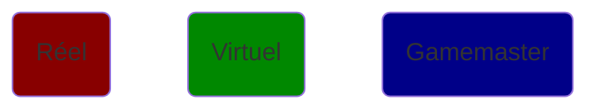
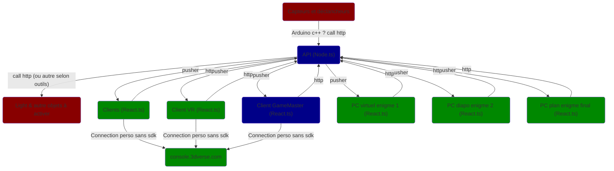

# Tech

```mermaid
flowchart TB
    R("Réel")
    V("Virtuel")
    GM("Gamemaster")
    
    style R fill:#880000
    style V fill:#008800
    style GM fill:#000088
```

```mermaid
flowchart TB
    R1("Light & autre objets à activer")
    R2("Capteurs et déclancheurs")
    V("console.3dverse.com")
    C1("Clients (React.ts)")
    C2("Client VR (React.ts)")
    C3("Client GameMaster (React.ts)")
    E1("PC virtuel enigme 1 (React.ts)")
    E2("PC diapo enigme 2 (React.ts)")
    E3("PC plan enigme final (React.ts)")
    A("API (Node.ts)")
    
    A -- "pusher" --> C1 & C2 & C3 -- "Connection perso sans sdk" --> V
    A -- "pusher" --> E1 & E2 & E3
    C1 & C2 & C3 -- "http" --> A
    E1 & E2 & E3 -- "http" --> A
    R2 -- "Arduino c++ ? call http" --> A -- "call http (ou autre selon outils)" --> R1
    
    style R1 fill:#880000
    style R2 fill:#880000
    
    style V fill:#008800
    style C1 fill:#008800
    style C2 fill:#008800
    style E1 fill:#008800
    style E2 fill:#008800
    style E3 fill:#008800
    
    style C3 fill:#000088
    style A fill:#000088
```